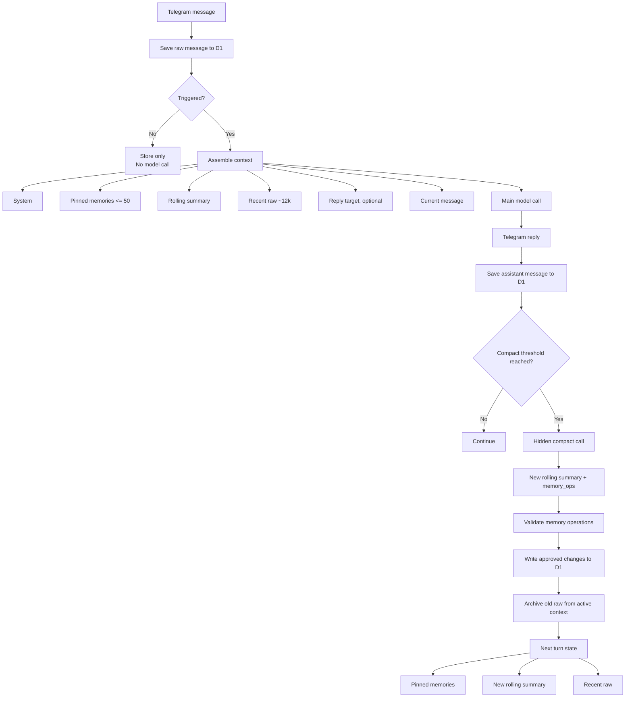

# Architecture

Afterglow Mini is a lightweight conversational memory architecture built around a simple constraint:

> Keep the normal response path to a single model API call.

Memory maintenance does not run on every turn. A second hidden model call is only used when the active context reaches the compact threshold.

## Flow



## Normal response path

When a Telegram message arrives:

1. The raw message is saved to D1 first.
2. The worker checks whether the bot should respond, such as an `@Bot` mention or a direct reply.
3. Non-triggering messages remain stored but do not invoke a model.
4. Triggering messages assemble one context package.
5. The main model is called once.
6. The reply is sent to Telegram and stored back in D1.

The assembled context contains:

```text
System
+ Pinned Memories (<= 50)
+ Rolling Summary
+ Recent Raw (~12k)
+ Reply Target (optional)
+ Current Message
```

This keeps memory retrieval deterministic and avoids a separate retrieval or memory-model call on every response.

## Compact path

After the assistant message is stored, the worker checks the active context size.

If the compact threshold has not been reached, nothing else happens.

If the threshold is reached, Afterglow Mini makes one hidden compact call. This call does not reply to the user. It returns:

```text
New Rolling Summary
+ memory_ops
```

Supported memory operations:

- `noop`
- `upsert`
- `insert`
- `delete`
- `replace`

The worker validates those operations, enforces the pinned-memory limit, writes approved changes to D1, and moves older raw messages out of the active context.

The next turn then starts from:

```text
Pinned Memories
+ New Rolling Summary
+ Recent Raw
```

## Storage role

D1 is the durable state layer for:

- raw user and assistant messages
- the rolling summary
- pinned memories
- compacted or archived conversation state

Messages are persisted before model invocation so storage and response triggering remain separate concerns.
